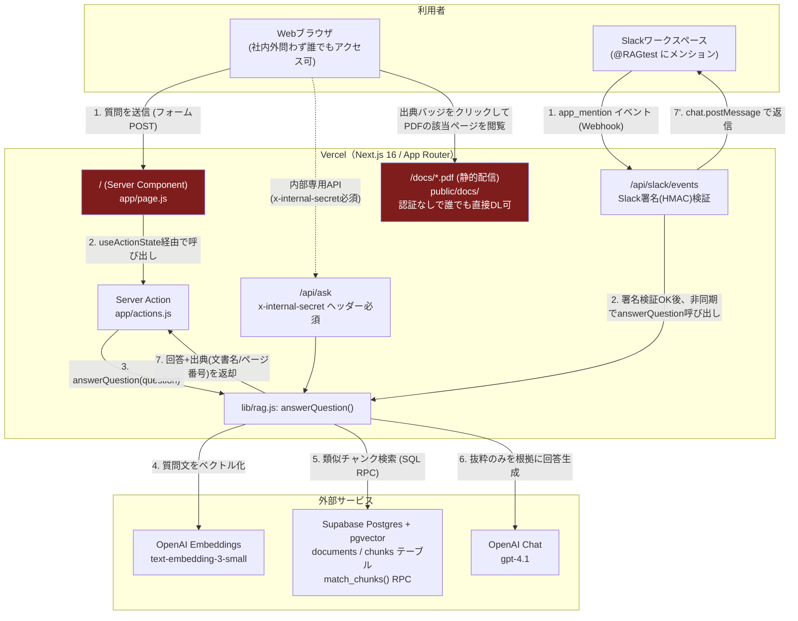
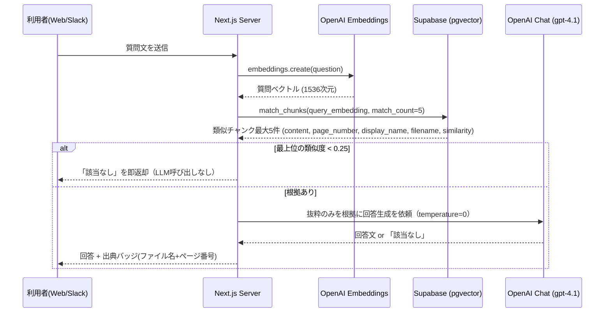
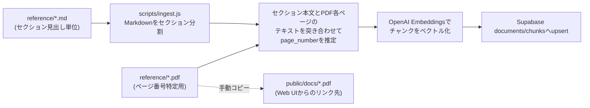

# アーキテクチャ図（情シス向け）

対象システム: テックブリッジ 社内文書アシスタント（`techbridge-rag`）
最終更新: 2026-08-30

> 本ドキュメントは情報システム部門向けに、システム構成・データフロー・認証境界・シークレット管理・デプロイ環境を技術的にまとめたものです。クライアント向けの使い方は [`operations-guide.md`](./operations-guide.md) を参照してください。

## 1. システム全体構成

**赤色のノードは「認証なしで誰でもアクセス可能」な箇所**（後述 §4 参照）。

## 2. 質問応答の処理シーケンス

ポイント:
- 類似度が閾値（0.25）未満の場合はLLMを呼ばずに「該当なし」を返すため、**ハルシネーション対策と無駄なAPIコストの抑制を両立**している。
- LLMには常に「抜粋にない内容は一切補完せず『該当なし』とだけ返答せよ」という system prompt を渡しており、抜粋があってもLLM自身が「該当なし」と判断できる二段構えになっている。

## 3. 文書取り込み（オフラインバッチ）

- 実行コマンド: `node --env-file=.env.local scripts/ingest.js`（開発者が手動実行。CI化・自動再取り込みの仕組みは未実装）
- ページ番号はPDFの実テキストとの突合による**推定値**であり、100%保証ではない（本番投入前に代表チャンクの抜き取り確認を推奨）。

## 4. 認証・境界の現状（重要）

| エンドポイント / 資産 | 認証方式 | 現状 |
| --- | --- | --- |
| `/`（Web質問フォーム） | **なし** | 誰でもURLを知っていればアクセス・質問可能。社内メールドメイン制限は**未実装**。 |
| `/docs/*.pdf`（引用元PDF） | **なし** | `public/`配下の静的ファイルのため、URLを知っていれば認証なしで直接ダウンロード可能。 |
| `/api/ask`（内部API） | 共有シークレット（`x-internal-secret`ヘッダー） | 固定シークレットの一致のみを見る簡易認証。ユーザー単位の認証・認可ではない。 |
| `/api/slack/events` | Slack署名検証（HMAC-SHA256、`SLACK_SIGNING_SECRET`） | Slackからのリクエストであることのみを検証。タイムスタンプの経年チェックあり（5分）。 |
| Supabase `documents`/`chunks` | Row Level Security 有効、`anon`キーからは不可 | サーバーは`service_role`キーのみ使用。クライアント（ブラウザ）から直接DBへはアクセス不可。 |

**ギャップ**: 「社内メールドメイン制限」のような利用者単位の認証は、Web UI・PDF配信のいずれにも実装されていません。現状は事実上フルオープンな公開ツールです。社内限定運用が要件であれば、以下いずれかの追加実装が必要です。
- Vercelの [Vercel Authentication / Trusted IPs](https://vercel.com/docs/security) や、Google Workspace SSO（社内メールドメイン制限）を`middleware.js`で挟む
- `public/docs/`を認証必須の署名付きURL配信（Supabase Storageの署名URL等）に置き換える

## 5. シークレット・環境変数管理

すべてのAPIキー・トークンはコードに直書きせず、環境変数（Vercel Environment Variables / ローカルの`.env.local`）で管理している。`.env.local`・`.env*`は`.gitignore`済みで、Gitリポジトリには含まれない（`.env.example`は空テンプレートのみをコミット）。

| 変数名 | 用途 | 管理場所 |
| --- | --- | --- |
| `OPENAI_API_KEY` | Embeddings / Chat 呼び出し | Vercel Production Env |
| `NEXT_PUBLIC_SUPABASE_URL` / `NEXT_PUBLIC_SUPABASE_ANON_KEY` | Supabaseクライアント初期化用（anonキーはRLSにより閲覧不可） | Vercel Production Env |
| `SUPABASE_SERVICE_ROLE_KEY` | サーバー側のみで使用しRLSをバイパス | Vercel Production Env（サーバー専用、クライアントに露出しない） |
| `INTERNAL_API_SECRET` | `/api/ask` の簡易認証 | Vercel Production Env |
| `SLACK_BOT_TOKEN` / `SLACK_SIGNING_SECRET` | Slack投稿・署名検証 | Vercel Production Env |

## 6. ホスティング環境・リージョン

| コンポーネント | サービス | リージョン |
| --- | --- | --- |
| Webアプリ（Next.js） | Vercel | **要修正**: サーバーレス関数の実行リージョンは `iad1`（米国東部・バージニア）。エッジキャッシュ配信のみ東京(`hnd1`)を経由しており、**計算処理自体は東京リージョンではない**。東京固定が要件であれば `vercel.json` に `{"regions": ["hnd1"]}` を設定する必要がある（Vercel Proプラン以上が必要）。 |
| データベース（Postgres + pgvector） | Supabase | **要確認**: CLI/APIレスポンスからはリージョンを確認できなかった。Supabaseダッシュボード → Project Settings → General → Region で要確認。東京リージョン（`ap-northeast-1`）でない場合、Vercel(iad1)⇄Supabase間のレイテンシが増える点にも留意。 |
| PDF静的ファイル | Vercel Edge Network（CDN） | グローバル配信（東京含む） |

## 7. 既知の制約・スコープ

- 現在取り込み済みの文書は **5種類のサンプルPDF**（就業規則・経費精算・情報セキュリティ規程・リモートワーク規程・社内ITツールガイド）。いずれも `reference/*.md` に「実在の規程ではないサンプル」と明記されたテスト用文書であり、200文書規模の本番相当データは未投入。
- 文書追加・更新の自動化（CI連携、Web UIからのアップロード等）は未実装。追加時は開発者が`reference/`にファイルを追加し、`scripts/ingest.js`を手動実行する運用。
